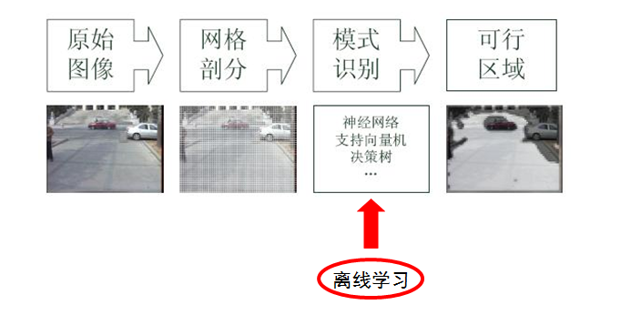
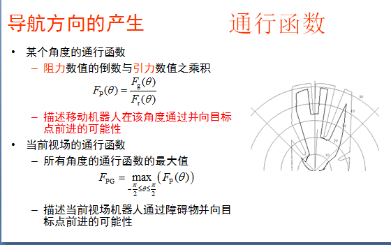

# 多模态目标感知技术
## 定义：
指对于一个待描述事物，通过不同的方法或视角收集到的耦合的数据序列。把收集这些数据的每一个方法或视角称之为一个模态。
* 注1：针对的是同一个事物。
* 注2：不同的方法（包括不同传感器、不同算法等）观测的数据。
* 注3：不同视角（可以是同一个传感器，相同算法等）观测的数据。
* 注4：兼具独立性与互补性：处理前期，降低模态间影响；处理后期，增加模态间互补性。

## 激光雷达和摄像头：
* 激光雷达特点：
 * 成本高
 * 主动传感器（容易被发现）
 * 信息单一
 * 容易处理，计算量较小

* 摄像头特点：
 * 成本低
 * 被动传感器（比较隐秘）
 * 信息丰富
 * 处理困难，计算量高

* 基于激光雷达与视觉的融合目标检测
 * 利用优缺点互补，融合之后，检测更准确。
 * 激光测距雷达能得到障碍物的距离信息，并通过聚类算法，能够得到不同障碍物类的距离、位置以及宽度，但在雷达数据中却不容易区分是哪一类障碍物。
通过基于视觉的障碍物检测，通过机器学习的办法可对不同障碍物进行分类并检测，这恰恰弥补了雷达对障碍物识别的不足。

## 道路（可行区域）检测方法：
* 离线学习：环境相对固定，可以事前准备好样本。样本数量有限，精度受限。
* 在线学习：不能事前准备样本。

### 离线学习：

* 原始图像：通过摄像头获取的图片。
* 网格划分：通常以20*20 pixels为单位。
* 模式识别：可以使用多种机器学习算法，判断网格是否属于可行区域。
* 可行区域：生成可行区域图。
#### 基于离线学习的多模感知示例：
* 前视图：一般摄像头的角度看到的图片。障碍物（非道路区域）检测结果的置信度要高于对于道路的置信度。
* 经逆投影变换过后的俯视图：一种对俯视图的投影变换处理技术。道路的置信度将高于障碍物的置信度。
* 所以可以将两种图进行信息融合，提高整体（场景）识别精度。
#### 双视图融合法处理过程：

* 透视图可视为原始图像。
* 网格划分，以20*20分割图像为若干个网格。
* 针对每个网格提取特征，以道路为例。
* 以RGB直方图特征作为路面特征学习的基础，以此计算每个网格的特征值。
* 采用基于RBF核函数的支持向量机作为基本分类器进行路面外观的机器学习。以此判断每个网格是否数据道路。
* 分类器需要前期训练，事先采集若干正反例样本，按照前面几个步骤，训练分类器。
* 针对俯视图，采取相同的处理，然后进行融合，算法有很多，可以采用D-S证据理论等方法。
* 处理的结果可以生成针对具体环境的通路图。因为感知过程是连续的，所以可以对时间域融合，进而获取全局地图，这也就是vslam的过程了。

#### 导航方向的产生：
有了全局地图之后，接下来就是怎么运动，也就是导航，确切的说就是运动角度。
通常分两个步骤：
* 求出某个角度的通信函数：
* 当前视角的通信函数。

### 在线学习
* 离线学习：属于监督类学习。
* 在线学习：属于半监督类学习，也就是仅在初始时刻需要监督信息（可以由人获其他传感器提供），运行过程中不再需要监督信息，仅仅依靠在实时运行过程中采集到的未标注样本进行分类器在线更新。适用于动态环境。

#### 基于在线学习的多模感知示例：
可以通过一个协同学习机制实现。示例分别采用SVM分类器和直方图反向投影器作为两个学习器，利用协同学习机制建立道路区域检测的协同学习框架。
两类分类器针对同一个场景，利用不同的特性，例如颜色和纹理，实现不同的分类器，以此提高场景实现的精度。

##### 纹理特征识别
可以采用多方向Gabor纹理直方图特征
##### 颜色特征识别
直方图反向投影器
